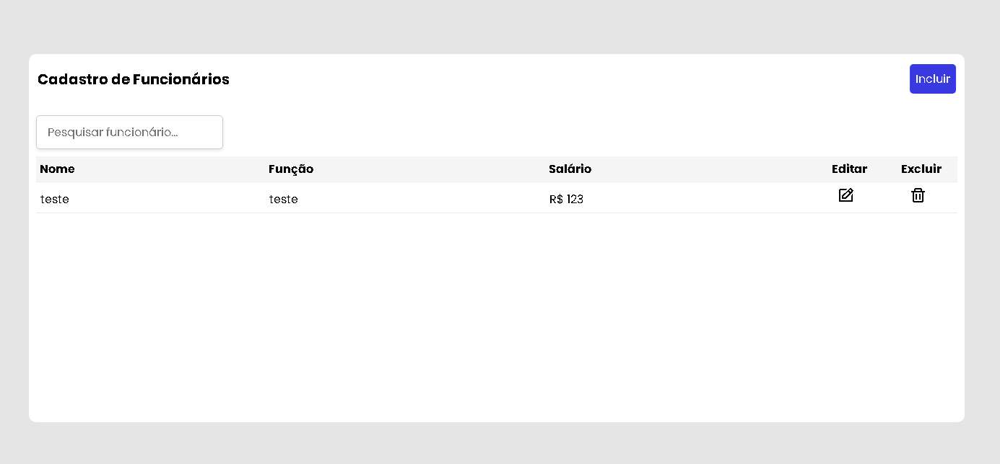

# Cadastro de Funcionários

link do site https://kayocavalcantte.github.io/cadastro-funcionarios/

Este é um sistema CRUD (Create, Read, Update, Delete) desenvolvido para o cadastro de funcionários, permitindo a criação, visualização, edição e exclusão de registros de funcionários. O sistema é construído usando HTML, CSS e JavaScript, e utiliza o localStorage do navegador para persistência dos dados.

## Funcionalidades

- **Cadastro de Funcionários**: Adicione novos funcionários com nome, função e salário.
- **Listagem de Funcionários**: Visualize todos os funcionários cadastrados em uma tabela.
- **Edição de Funcionários**: Edite as informações de qualquer funcionário já cadastrado.
- **Exclusão de Funcionários**: Exclua funcionários da lista.
- **Barra de Pesquisa**: Filtre a lista de funcionários pelo nome, permitindo uma busca rápida e eficiente.
- **Ordenação**: Os funcionários são automaticamente ordenados em ordem alfabética pelo nome.
- **Interface Responsiva**: O design é adaptado para funcionar bem em dispositivos móveis.

## Tecnologias Utilizadas

- **HTML**: Estrutura básica do projeto.
- **CSS**: Estilização da interface, incluindo responsividade e design moderno.
- **JavaScript**: Lógica de funcionamento do CRUD e manipulação do localStorage.

## Estrutura do Projeto

- **index.html**: Arquivo principal da aplicação, contendo a estrutura HTML.
- **css/style.css**: Contém a estilização da aplicação.
- **js/script.js**: Contém toda a lógica do CRUD e manipulação do DOM.

## Personalização

Você pode facilmente personalizar este sistema ajustando o código CSS para alterar o design, ou modificando o JavaScript para adicionar novas funcionalidades, como filtros adicionais ou novos campos no cadastro.

## Contribuição

Contribuições são bem-vindas! Sinta-se à vontade para abrir uma issue ou enviar um pull request com melhorias, correções de bugs ou novas funcionalidades.

## Licença

Este projeto é licenciado sob a MIT License.
